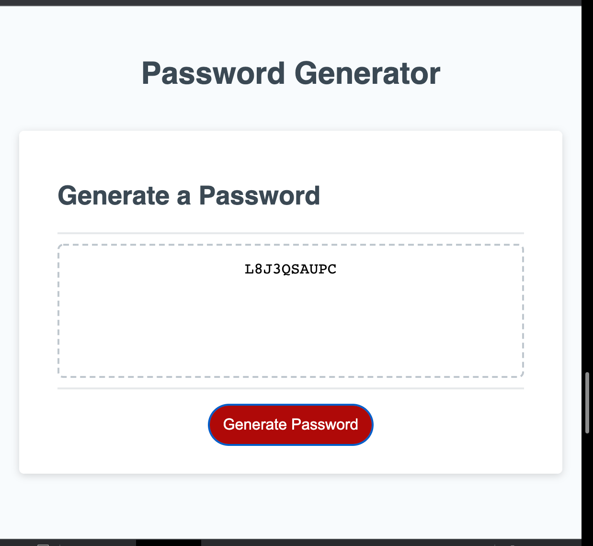

# password-generator

#### Code Used - Javascript 

#### Object to create a password Generator which provides random passwords for Uppercase Letter Characters, Lowercase Letter Characters , Number Characters ,and Special Characters following parameters.

#### Parameters - Enter correct length 8-128 characters.
#### Select at least one Variable Character to start password generator.

#### Set up 2 alerts when Parameters are not met 
#### Set up Prompts to choose from Variable Arrays 

#### Url:  https://jump89.github.io/passwoord-generator/
#### Github Url: https://github.com/Jump89/passwoord-generator
#### Screen shot of password generated 

